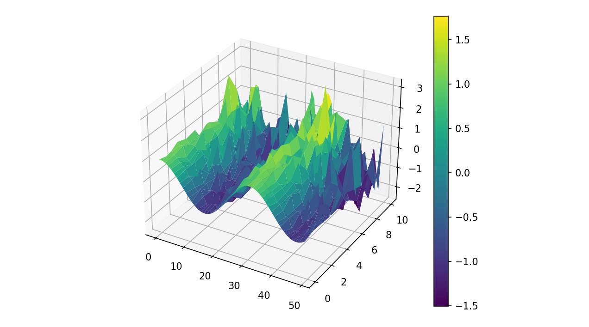
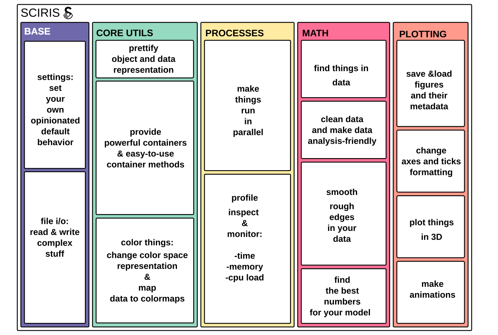

# Summary 

[Sciris](https://github.com/sciris/sciris) is a collection of tools that provides shortcuts to using foundational libraries from the scientific Python ecosystem (such as `numpy` and `matplotlib`), as well as with libraries of broader scope, such as `multiprocess` and `pickle`. The purpose of Sciris is to accelerate the development of easy-to-use scientific software. This is achieved by providing classes and functions that simplify access to frequently used functionality which, while essential for the development of robust software applications, diverts focus from the actual problem being solved. Some of Sciris' key features include: ensuring consistent dictionary, list, and array types (e.g., enabling users to provide inputs to a class or method as either lists or arrays); enabling ordered dictionary elements to be referenced by index; simplifying datetime arithmetic by allowing users to provide dates in any format, including strings; simplifying the saving and loading of files and complex objects; and simplifying the parallel execution of code. Sciris makes writing scientific code in Python faster, more pleasant, and more readable for a diverse non-specialist audience. With Sciris, users can: get the same functionality with fewer lines of code, avoid the need to reinvent the wheel, and spend less time looking up solutions on Stack Overflow. Sciris also forms the basis of ScirisWeb, an additional set of tools for building Flask-based Python webapps. In contrast to [Plotly Dash](https://github.com/plotly/dash) and [Streamlit](https://streamlit.io/), which have limited options for customization, ScirisWeb is completely modular, so users can choose which features they use for a project. In summary, Sciris (whose name comes from a combination of "scientific" and "iris", the Greek word for "rainbow") aims to streamline the wide spectrum of tasks commonly required in the  development of scientific computing applications.


# Statement of need

With the increasing availability of large volumes of data and computing resources, scientists across multiple fields of research have been able to tackle increasingly complex problems. But to harness these resources, the need to develop and use domain-specific software has become a ubiquitous part of scientific projects. Commensurate with the complexity of problems, these software-related activities have also become increasingly complex, creating a steep learning curve and an increasing burden of code review [@burden-codereview].

<!-- NOTE: need to find a recent paper where they show survey results of the state of scientific code production, to justify the "large fraction" phrase, I know i read one last year or the year before but i can't remember the authors. or journal. Maybe it was a blog post.  -->
The current reality of scientific code production is that any workflow (e.g., either a full cycle in the development of a new software library, or in the execution of a one-off individual analysis) very often relies on multiple codebases, including but not limited to: low-level libraries; domain-specific open-source software; and self-developed and/or inherited swiss-army-knife toolboxes -- whose original developer may or may not be around to pass on undocumented wisdom. Several scientific communities have adopted collaborative, community-driven, open-source software approaches due to the significant savings in development costs and increases in code quality that they afford [@kerr2019epidemiology] (e.g., astropy [@robitaille2013astropy], nilearn [@nilearn] and fmriprep [@esteban2019fmriprep], [HoloViz's libraries](https://holoviz.org)). Despite this progress, a large fraction of scientific software efforts remain a solo adventure leading to proliferation of tools where resources have been spent reinventing the wheel.

<!-- NOTE: astropy and nilearn get a mention here because of their scale 
and the size of the core dev team. There are other libraries such as seaborn and pingouin that are also open-source projects, but still are heavily developed and maintained by a single developer -->
Scientific software differs from commercial production software in that it is a crucial component in the elaboration of scientific conclusions, and as such it should be: re-runnable, repeatable, reproducible, reusable, and replicable [@benureau2018re]. A key aspect to ensure these properties is readability of tutorials, documentation and especially of code itself. **But it is essential to note that low level programming abstractions may not be a great way to express human-readable scientific ideas or solutions, which is what scientific code should convey**. For instance, one of the reasons PyTorch has become popular in academic and research environments is its success in making models easier to write compared to TensorFlow [@pytorch-research].

The need for libraries that provide "simplifying interfaces" for research applications is reflected by the development of various notable libraries in scientific Python ecosystem, that have enabled researchers focus their time and efforts on solving problems, prototyping solutions, deploying applications and educating their communities. Some of these include PyTorch, seaborn[@waskom2021seaborn], DataLad [@halchenko2021datalad], pingouin [@vallat2018pingouin], hypothesis [@maciver2019hypothesis], Mayavi [@ramachandran2011mayavi] and PyVista [@sullivan2019pyvista], just to name a few though there are many more.

Sciris itself traces its origins to 2014, initially created to support development of the Optima suite of models [@kerr2015optima]. Among the existing libraries at the time we had not found one that simplified the complex semantics of powerful containers or the parallelisation of trivial yet data-intensive operations. We kept encountering the same inconveniences over and over while building scientific webapps, and so began collecting the tools we used to overcome them into a shared library. While Python was, and still is, considered an easy-to-use language for beginners, the motivation that shaped Sciris' evolution was to further lower the barriers to access, interact with, and orchestrate the numerous supporting libraries we were using.

For those reasons Sciris provides tools that will result in a more effective and sustainable scientific code production for solo-developers and teams alike, and increased longevity [@perkel2020challenge] of new scientific libraries. Some of the key functional aspects that Sciris provides are: (i) brevity through simplifying interfaces; (ii) scientific idiomaticity; (iii) locally scoped forgiving and strict exception handling; and, (iv) management of versioning information. We expand on each of these in Overview.

# Example
<!-- (perhaps mention a few of the libraries/dependencies) -->
The Sciris library offers a coordinating interface to multiple well established and highly flexible Python libraries. Writing a script that directly uses multiple of these underlying libraries can obscure the key logic of the scientific problem. Whereas the Sciris interface keeps the focus on the science.

For instance let us imagine that we want to randomly sample numbers from a user-defined smooth function. In addition, we want to repeatedly draw numbers for multiple levels of noise, and save these results in separate files. At a later stage, we would like to load the independent files, "glue" them together to reconstruct a surface embedded in 3D by interpolating the random samples; and finally, we want to plot the random points and surface together. Parallelizing the repeated draws and customizing the axes to render the 3D scatter plot plus mesh can be quite cumbersome. \autoref{fig:showcase-code} presents two functionally identical scripts and  highlights that the one written with Sciris is much more succinct and readable:

{ width=100% }

{ width=100% }


# Overview
The current stable version of Sciris (2.0.0) includes implementations of heavily used code patterns and abstractions that facilitate the development and deployment of complex domain-specific scientific applications, regardless of their scope and scale, and further enables non-specialist audiences to interact with these complex applications. We note that Sciris "stands on the shoulders of giants", and as such is not intended as a replacement of those, but rather as an interface that facilitate a more effective and sustainable development process through:

*Brevity through simplifying interfaces*. Sciris affords brevity to its users by encapsulating common regular patterns that span multiple lines of code into a function with a simple interface. With these functions one can succinctly express and execute (i) frequent plotting tasks (i.e., `sc.fig3d`, `sc.ax3d`, `sc.hex2rgb`); (ii) less frequent tasks like pretty printing numeric arrays with up to 3 axes (e.g., `sc.printarr`) that can be useful for debugging; frequent but less simple tasks like merging containers (e.g., `sc.mergedicts`, `sc.mergenested`, `sc.mergelists`), or line-by-line memory profiling (`sc.mprofile`).
Brevity is also achieved by extending functionality of well established objects (e.g., `OrderedDict` via `sc.odict`) or methods (e.g., `isinstance` via `sc.checktype` that enables the comparison of objects against higher-level types like `listlike`)

<!-- (e.g., one would not include the 'how-to-assemble' manual a spectrophotometer as part of a every report on protein analysis).
 -->
*Scientific idiomaticity*.
Sciris uses idiomatic function names (i.e., `sc.smooth`, `sc.findnearest`, `sc.safedivide`) so that the resulting code is as scientifically and human-readable as possible. Further, we note that some of Sciris function names are similar to Matlab's (i.e., `sc.tic` and `sc.toc`). This is because there is often a need to either translate from/to Matlab or R, or to integrate code components written in multiple languages.

*Forgiving and strict exception handling*.
Across many complex classes and methods, Sciris uses the keyword `die`, enabling users to set a locally scoped level of strictness in the handling of exceptions. If `die=False`, Sciris is more forgiving and softly handles exceptions by using its default (opinionated) behavior. This could be simply printing a message and returning `None` so users can decide how to proceed. If `die=True`, it directly raises the corresponding exception and message. 

*Management of versioning information*.
Keeping track of dates, authors, code version, plus additional notes or comments is an essential part of scientific projects. Sciris provides methods to easily save and load metadata to/from figure files, including Git information (`sc.savefig`, `sc.gitinfo`, `sc.loadmetadata`), but also methods to compare between two version numbers with any possible combination of an (in)equality operator (`sc.compareversions`).

Our approach with Sciris was confirmed to have paid off when in early 2020 its combination of brevity and simplicity proved crucial in: (i) the faster-than-average development of Covasim [@kerr2021covasim; @kerr2022python]; and (ii) enabling Covasim to become one of the most widely adopted COVID models, used by students, researchers and policy makers alike. In addition to Covasim, Sciris is currently used in a number of scientific applications [@kedziora2019cascade; @atomica; @fraser2021using; @hiptool; @synthpops; @parestlib] and since 2022 has been designated as a critical project on the Python Package Index ([PyPI](https://pypi.org)).

In \autoref{fig:block-diagram} we illustrate the functional modules of Sciris.

{ width=100% }

## Highlights
Sciris provides class- and function-based implementations of common operations ranging from parallelization to improved object representation, below we provide a selection of examples. It is by no means an exhaustive description of Sciris' capabilities, but further information can be found at [https://sciris.readthedocs.io](https://sciris.readthedocs.io). Documentation includes installation instructions for both [Sciris](https://github.com/sciris/sciris) and [ScirisWeb](https://github.com/sciris/scirisweb); [how-to-contribute guidelines](https://sciris.readthedocs.io/en/latest/contributing.html); and [style guide](https://sciris.readthedocs.io/en/latest/style_guide.html).

<!-- NOTE: present some key features (only a subset of functions that i was immediately drawn too in Sciris)   -->

### Containers 
One of the key features in Sciris is `odict`, a flexible container representing an associative array with the best-of-all-worlds across lists, dictionaries, and numeric arrays. This is based on `OrderedDict` from [`collections`](https://docs.python.org/3/library/collections.html), but supports list methods like integer indexing, key slicing, and item inserting.

```Python
> my_odict = sc.odict(foo=[1,2,3], bar=[4,5,6]) 
> my_odict['foo'] == my_odict[0]                
> my_odict[:].sum() == 21                       
> for i, key, value in my_odict.enumitems():    
     print(f'Item {i} is named {key} and has value {value}')
```

### Container methods 

`sc.promotetolist` developed so user-defined functions can handle inputs like ``'a'``  or ``['a', 'b']``. In other words, if an argument can either be a single thing (e.g., a single dictionary key) or a list (e.g., a list of dictionary keys), this function can be used to do the conversion, so it is always safe to iterate over the output.

`sc.mergedicts`, by default, skips things that are not dictionaries (e.g., `None`), and allows keys to be set multiple times. The first dictionary supplied will be used for the output type (e.g., if the first dictionary is an `sc.odict`, an `sc.odict` will be returned). This function is useful for cases such as function (keyword) arguments where the default is simply set as `None` but later on a dictionary will be needed.

`sc.flattendict`, flattens a nested dictionary 

```Python
> sc.flattendict({'a':{'b':1,'c':{'d':2,'e':3}}})
{('a', 'b'): 1, ('a', 'c', 'd'): 2, ('a', 'c', 'e'): 3}


> sc.flattendict({'a':{'b':1,'c':{'d':2,'e':3}}}, sep='_')
{'a_b': 1, 'a_c_d': 2, 'a_c_e': 3}
```

### Prettify object/data representations (or how to make stuff more human-readable)

`sc.prettyobj` is a class that produces a pretty representation for objects, instead of just showing the type and memory pointer (Python's default for objects). 
```Python
> myobj = sc.prettyobj()
> myobj.a = 3
> myobj.b = {'a':6}
> print(myobj)
<sciris.sc_utils.prettyobj at 0x7ffa1e243910>
————————————————————————————————————————————————————————————
a: 3
b: {'a': 6}
————————————————————————————————————————————————————————————
```
This class can also be used as the base class for custom
classes.

```Python
> class MyObj(sc.prettyobj):
>
>     def __init__(self, a, b):
>         self.a = a
>         self.b = b
>
>     def mult(self):
>         return self.a * self.b

> myobj = MyObj(a=4, b=6)
> print(myobj)
<__main__.MyObj at 0x7fd9acd96c10>
————————————————————————————————————————————————————————————
Methods:
  mult()
————————————————————————————————————————————————————————————
a: 4
b: 6
————————————————————————————————————————————————————————————
```

<!-- ### Don't paint it black  
`sc.vectocolor` converts a 1D array of N values into an Nx3 array
of RGB values according to the current colormap. `sc.arraycolor` extends this functionality to multidimensional arrays. 
 -->
### Parallelization
We have found that one frequent hurdle scientists face is parallelization. Sciris provides `sc.parallelize`, which acts as a shortcut for using `multiprocess.Pool()`. Importantly, this function can also iterate over more complex arguments. It can either use a fixed number of CPUs or allocate dynamically based on load (`sc.loadbalancer`). Users can also specify a fixed number of CPUs to be used. The example below shows three different equivalent ways to iterate over multiple arguments:
```Python
> def f(x,y):
>     return x*y

> results1 = sc.parallelize(func=f, iterarg=[(1,2),(2,3),(3,4)])
> results2 = sc.parallelize(func=f, iterkwargs={'x':[1,2,3], 'y':[2,3,4]})
> results3 = sc.parallelize(func=f, iterkwargs=[{'x':1, 'y':2}, 
                                                {'x':2, 'y':3}, 
                                                {'x':3, 'y':4}])

> assert results1 == results2 == results3
```

### Math functionality
`sc.findinds` matches even if two things are not exactly equal due to differences in numeric type (e.g., floats vs. integers). If called with one argument, finds nonzero values. Called with two arguments, check for equality using `eps`. The code shown below produces the same result as calling `np.nonzero(np.isclose(arr, val))[0].`
```Python
> sc.findinds([2,3,6,3], 3) 
array([1,3])
```

`sc.asd`: Sciris provides an implementation of the adaptive stochastic descent (ASD) optimization algorithm described in [@kerr2018optimization], and that has been designed to replicate the essential aspects of manual parameter fitting in an automated way. Specifically, ASD uses simple principles to form probabilistic assumptions about (a) which parameters have the greatest effect on the objective function, and (b) optimal step sizes for each parameter.

# ScirisWeb
ScirisWeb provides a solution using [Vuejs](https://vuejs.org/) for the frontend, [Flask](https://flask.palletsprojects.com/en/2.2.x/) as the web framework, [Redis](https://redis.io/) for the (optional) database and Matplotlib/[mpld3](https://github.com/mpld3/mpld3) for plotting. ScirisWeb  also enables users to use a React frontend linked to an SQL database with Plotly figures, ScirisWeb can serve as the glue holding all of that together. We note that ScirisWeb, while functional, is still in beta development.

# Acknowledgements

The authors wish to thank David P. Wilson, William B. Lytton, and Daniel J. Klein for their sponsorship of the Sciris project. David J. Kedziora, Dominic Delport, Kevin M. Jablonka, and Meikang Wu provided helpful feedback on and support for the Sciris library.


# References