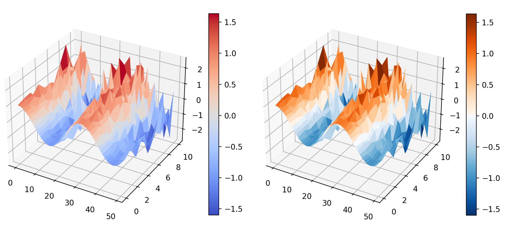

# Summary

Sciris is a cohesive collection of tools that enables an easy and simple
interaction with foundational libraries from the scientific Python ecosytem
(e.g., `numpy`, `scipy`, and `matplotlib`), as well as with libraries with
broader scope such as `multiprocessing` and `pickle`. Sciris purpose is the
facilitation and acceleration of the development and delivery process of
easy-to-use domain-specific scientific software. This has been achieved by
creating classes and methods that simplify interfaces to frequently used
supporting functionality,  which is essential for the development of robust
software applications, but may divert the focus from the actual problem to be
solved. Some of Sciris key features include: ensuring consistent dictionary,
list, and array types(e.g., this would enable users to provide inputs to a
class or method as either lists or arrays); enabling referencing ordered
dictionary elements by index; simplifying datetime arithmetic by allowing
users to provide either a date string or a datetime object; simplifying the
saving and loading of files and complex objects; and, simplifying the
parallelisation of common operations. Sciris makes writing scientific code in
Python faster, more pleasant and more readable for a diverse non-specialist
audiences. This means that with Sciris users can get more done with less
code, without the need to reinvent the wheel, and spend less time looking
things up on StackOverflow (or the other 20+ tabs with the documentation of
every single library your new application is built upon). Further, Sciris
offers an extension to build webapps for in Python: ScirisWeb. In contrast to
Plotly Dash (ref) and Streamlit (ref), which have limited options for
customization, ScirisWeb is modular, so users have control over which subset
of modules to use for which aspects of any project. 

The name Sciris, a combination of Scientific + Iris (Greek word for
"rainbow"), thus honours the wide spectrum and diversity of commonly done
 scientific tasks, as well as the well established low-level interfacing
 libraries required in the development of scientific computing applications.

# Statement of need
<!-- TODO: rearrange paragraphs, remove overall repetition and move some paras to new section;
  Reduce this section by about 50% of its current length (in pdf format)
 -->

With the increasing availability of large volumes of data and computing
resources, scientists across multiple fields of research have been able to
tackle increasingly complex problems. But to harness those resources, using
and developing domain-specific software has become ubiquitous activities in
scientific projects. 

Commensurate with the complexity of problems, these software-related
activities have also become increasingly complex, creating a steep learning
curve, especially for scientists without extensive computer programming
literacy. 

<!-- NOTE: maybe emphasise the fact that at least in research/academic environments the proportion of 
single developer projects is probably the most common scenario, thus Sciris reduces a lot of development overhead for individuals and/or small teams. There's also an inclination to reinvent the wheel, but that's a behavioural issue. 
 -->
The current reality is that any scientific workflow (e.g., either a full cycle
in the development of a new software library, or in the execution of a
one-off individual analysis) very often relies on multiple codebases,
including but not limited to: low-level libraries, domain-specific
open-source software, self-developed and/or inherited swiss-army-knife
toolboxes -- whose original developer may or may not be around to pass on
undocumented wisdom. Several scientific communities have adopted
collaborative, community-driven, open-source software projects due to the
significant savings in development costs and increases in code quality that
they afford [@kerr2019epidemiology] (e.g., nilearn [@nilearn] and fmriprep [@esteban2019fmriprep]). Despite this progress there remains a pervasive inclination to reinvent the wheel among academics. 

Sciris traces its origins to 2014 to support development of the Optima suite
of models (ref). We kept encountering the same issues and inconveniences over
and over while building scientific webapps, and began collecting the tools we
used to overcome these issues into a shared library. While Python was and
still is considered an easy-to-use language for beginners(ref), the
motivation that shaped Sciris evolution was to further lower the barriers to
access, interact with, and orchestrate the numerous supporting libraries we were using.

Our endeavor paid off in early 2020 when the combination of brevity and
simplicity provided by Sciris was crucial in the faster-than-average
development of Covasim[@kerr2021covasim; @kerr2022python], and further
enabled Covasim to become one of the most widely adopted COVID models, used
by students, researchers and policy makers alike. In addition to Covasim,
Sciris is currently used in a number of scientific applications
[@kedziora2019cascade; @atomica; @fraser2021using] and since 2022 has been
designated as a critical project on the Python Pakacage Index (PyPI).

<!-- NOTE: at the momemnt the paras below sound disconnected from the rests
 -->
Sciris now includes implementations of heavily used code patterns and
abstractions we have identified over the last 8 years, and that we have
demonstrated facilitate the development and deployment of domain-specific
scientific applications regardless of their scope and scale. 

<!-- This may sound paradoxical -->
<!-- Sciris is domain-specific in the sense that it has been mostly developed by
researchers to be used by researchers. However, within the scope of scientific
software Sciris is domain-general because it can be used to develop
libraries for different research domains such as physics,
neuroscience or epidemiology.  -->

<!-- NOTE: mention other libraries and how Sciris compares to them
 -->
There are several libraries that follow this "simplifying interactions" principle to let
researchers focus their time an efforts in solving problems, prototyping
solutions, deploying applications and educating their communities. Some
examples include PyTorch, seaborn, datalad, vispy, good old Mayavi.
PyTorch made models easier to write compared to TensorFlow. It is used in production environments but its remains most popular in academic and in research environments [@pytorch-research]. 
 
<!-- (perhaps mention a few of the libraries/dependencies) -->
The Sciris library offers a coordinating interface to multiple well
established and highly flexible Python libraries, yet their simultaneous use
in a single simple script to (i) parallelise the sampling of random numbers
following a user-defined distribution embedded in 3D space, (ii) interpolate
the points to approximation a surface, and (iii) finally plot both the points
as a 3D scatter and the mesh can be quite cumbersome, and the
research-specific code (i.e., user-defined random sampler) may be obscured by
the "supporting" code required to parallelise operations and plot the data. 

<!-- NOTE: Sciris is a crucible (crisol in Spanish, which sounds much nicer imo)
 -->

<!-- NOTE: maybe cite a paper that discussed the number of scientific toolboxes that eventually die. 
Can help with the argument that Sciris may help prolong the longevity of scientific software.  -->

Our hope is that in using Sciris, researchers who routinely write and develop code will delegate the hard semantic bits to Sciris, and will be able to focus on the specific research problem they want to solve. 

# Usage
The example \autoref{fig:showcase-code} presents two functionally identical scripts and highlights that the one written with Sciris is much more succinct and readable:

<!-- Example: something as simple as providing an alias
moving average, rolling mean, rolling average, convolution  -->

{ width=100% }

{ width=65% }

# Overview
Sciris has been designed to provide class- and function based implementations
of common operations ranging from merging ordered dictionaries, to providing
simplified interfaces to datetime arithmetic, and to limiting the execution
of a program based on resource usage irrespective of the operating system or
computational environment where the application is executed. 

Sciris was built on the shoulders of giants like Numpy and Matplotlib, and as
such is not intended as a replacement of those, bur rather as a strongly
idiomatic scientific crucible that will result in a more effective and sustainable 
development process for solo-developers and teams alike (including increasing the longevity of new
scientific libraries). Sciris remains in active development and maintenance.
We note that ScirisWeb, while functional, is still in beta development.

ScirisWeb provides a ''just works'' solution using [Vuejs](https://vuejs.org/) for the frontend, [Flask](https://flask.palletsprojects.com/en/2.2.x/) as the web framework, [Redis](https://redis.io/) for the (optional) database and Matplotlib/[mpld3](https://github.com/mpld3/mpld3) for plotting. ScirisWeb  also enables users to use a a React (ref) frontend linked to an SQL database with Plotly figures, ScirisWeb can serve as the glue holding all of that together.

{ width=100% }

# Acknowledgements
To be added

# References